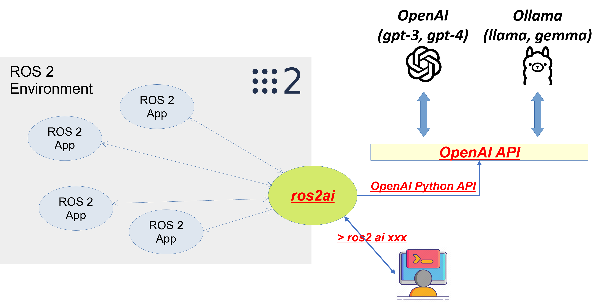

# ***ros2ai Next-Gen ROS 2 CLI***

[ros2ai](https://github.com/fujitatomoya/ros2ai) is a next-generation [ROS 2](https://github.com/ros2) command line interface extension with [OpenAI](https://openai.com/)

<!---
# Comment Here
--->

---

# [Everything Here!!!](https://github.com/fujitatomoya/ros2ai)

***Issues/PRs Welcome***

<!---
# Comment Here
--->

---

# [Let's see how this works!](https://github.com/fujitatomoya/ros2ai/assets/43395114/78a0799b-40e3-4dc8-99cb-488994e94769)

<video controls="controls" width="1000" src="https://github.com/fujitatomoya/ros2ai/assets/43395114/78a0799b-40e3-4dc8-99cb-488994e94769">

<!---
# This needs to be updated once new features become available in rolling branch.
--->

---

# [Docker Containers](https://hub.docker.com/repository/docker/tomoyafujita/ros2ai/tags?page=1&ordering=last_updated)

<video controls="controls" width="1000" src="https://github.com/fujitatomoya/ros2ai/assets/43395114/2af4fd44-2ccf-472c-9153-c3c19987dc96">

<!---
# Comment Here
--->

---

# Motivation

- (Originally just for fun 😂)
- Quickly get the answers against questions.
- Multiple Language Support.
- Support beginners and students. (your best trainer)
- Easy to use for everyone.
- Dedicated / AI based Support (your own concierge)
- Bridge / Proxy to [LLM](https://en.wikipedia.org/wiki/Large_language_model)

<!---
# Comment Here
--->

---

# Background

## I want the answers w/o searching...

browsing, clicking and typing many times to get to the information does not work for me. I need ***what***, not ***where***. all these are small things, but can be easily compiled up to mountain, especially beginners.

<!---
# Comment Here
--->

---

## I really do not care how to use ros2cli...

many sub-commands, options, and arguments. besides, those could be deprecated or removed time to time... this does not work for me. actually i just want to ask "what parameters are available?", "check the details for the topic /chatter", but before that i need to know how to do that... this is already barrier for beginners.

it would be better for maintenance if someone abstracts this to the user, so that maintainers can just go ahead to remove, change options w/o deprecation or certain soak time...

<!---
# Comment Here
--->

---

## Multi-Language Documentation

OSS projects tend to add multi-language support documentation under mainline doc. this is really likely, and they do. but the question is ***Does it really work?***... IMO, it does (will) not. eventually those docs will be outdated, not maintained, not scalable, not precise and once that happens these docs would be garbage.

i believe that is exactly where AI comes to play. instead of paying the resources to non-scalable things, focus on the mainline with precise information which is available for any languages.

<!---
# Comment Here
--->

---

# Design

- ***SIMPLE***. one of the original motivation, it has to be simple as much as possible. it would be even better to remove all sub-commands, just `ros2 ai <request>` if that is possible.

<!---
# Comment Here
--->

---

<!---
# Comment Here
--->

---

- `status` command is to check if `ros2ai` is configured with valid API key.
- `query` command is to ask any questions related to ROS 2. This is a single-shot completion, no session is supported currently. OpenAI system attribution is set to default, but can be reconfigurable.
- `exec` command is that AI executes the appropriate command based on the requests. OpenAI system attribution is set to default, but can be reconfigurable.

---

# Proposals (Ideas)

<!---
# These are just ideas, not even sure that is doable.
--->

---

# OpenAI Parameter Adjustment

- more stable AI behavior.
- cost(token) and latency.
- ~~ROS 2 distribution awareness. (should be fetched by ros2ai but user setting.)~~
- more...

---

# Session Mode

currently, `ros2ai` only supports single-shot completion API, that means we can not rely on the previous questions or answers to make further requests. e.g) "Is /chatter topic available?", "Subscribe it!". This ***it*** should be recognized in the same context or session. If this command is issued, prompt should be initiated to keep the session alive until the entire session is closed by the user.

<!---
# Comment Here
--->

---

# Proxy Agent

`ros2ai` can instantiate the agent daemon process as ROS 2 service, so that even other ROS 2 application running in the network can use OpenAI API via this proxy. those ROS 2 application can be agnostic from LLM specific APIs but ROS 2 service interface.

---

# Multiple LLM Support

- create abstraction layer to absorb backend LLM APIs? could be local LLM on edge, could be other service backends that depends on the business logics.
- `ros2ai` should be available for everyone in global, user should be able to switch the backend LLM service as they like.

<!---
# Comment Here
--->

---

# Fine-tuning (T.B.D)

- ROS 2 general fine-tuning
  - this requires scaled training dataset for ROS 2, agnostic from user environment. could be distro specific. so that AI can response more precisely based on questions and requests.
- User specified environment tuning
  - this dataset should be uploaded to help more user specific problems and questions. if this is doable, `ros2ai` agent can the 1st customer support for anyone?

<!---
# I am not even sure what could be done with it. need to come back here to consider the possibility.
--->
